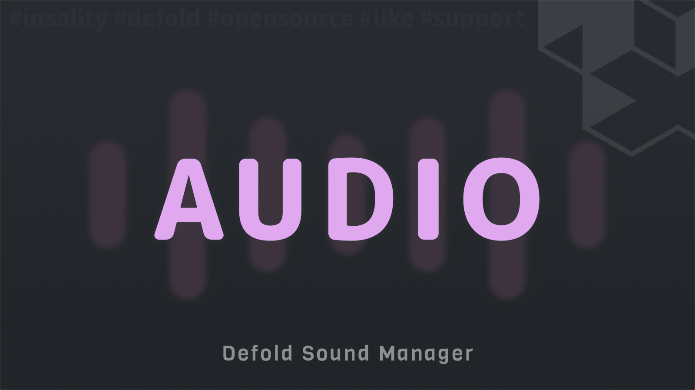

[](https://github.com/Insality/defold-audio/tags)
[](https://github.com/Insality/defold-audio/actions)
[](https://codecov.io/gh/Insality/defold-audio)

[](https://github.com/sponsors/insality) [](https://ko-fi.com/insality) [](https://www.buymeacoffee.com/insality)


# Audio

**Audio** - module is a lightweight sound manager for Defold. Register all your sounds once in a single config and play them by string id from anywhere in the game.

Instead of keeping the sound urls all over the project, you describe the sound once: where it is, how often it can be played, how many instances it can have and how much its pitch should be randomized. After that a single `audio.play("coin")` call is all you need.


## Features

- **Sounds Config** - Register all game sounds in one place and play them by id.
- **Sound Variations** - Pick a random url from the list and randomize the pitch to avoid the repetitive sounds.
- **Playback Control** - Play cooldown and max instances limit protects the game from the sound spam.
- **Group Gain** - Manage the gain of the sound groups with a state, ready to be saved between the game sessions.
- **Fade** - Fade the sound gain in and out over time. Useful for the music and ambient sounds.
- **Play Delay** - Schedule a sound to play after a delay and cancel it later by handle.

## Setup

### [Dependency](https://www.defold.com/manuals/libraries/)

> Can be installed from the [Asset Store](https://github.com/Insality/asset-store) extension to skip this step.

Open your `game.project` file and add the following line to the dependencies field under the project section:

**[Defold Audio](https://github.com/Insality/defold-audio/archive/refs/tags/1.zip)**

```
https://github.com/Insality/defold-audio/archive/refs/tags/1.zip
```

After that, select `Project ▸ Fetch Libraries` to update [library dependencies]((https://defold.com/manuals/libraries/#setting-up-library-dependencies)). This happens automatically whenever you open a project so you will only need to do this if the dependencies change without re-opening the project.

### Library Size

> **Note:** The library size is calculated as the size of the compiled Lua files in a release build

| Platform         | Library Size |
| ---------------- | ------------ |
| HTML5            | **9.95 KB**  |
| Desktop / Mobile | **10.16 KB** |


## Basic Usage

Place the sound components in your collection, for example in the `/sounds` game object, and describe them in the sounds config:

```lua
local audio = require("audio.audio")

audio.init({
	click = {
		url = "/sounds#click",
	},
	coin = {
		url = { "/sounds#coin_1", "/sounds#coin_2", "/sounds#coin_3" },
		random_pitch = 0.1,
		max_instances = 3,
	},
	music = {
		url = "/sounds#music",
		play_cooldown = 0,
	},
})

-- Play the sound by id
audio.play("click")

-- Play a random sound from the "coin" urls list with a random pitch
audio.play("coin")

-- Play the sound with the custom gain
audio.play("click", 0.5)

-- Schedule the sound to play in 0.5 seconds. Cancel with the returned handle
local handle = audio.play_delay("coin", 0.5)
audio.cancel_play_delay(handle)

-- Fade in the music in 1 second
audio.play("music", 0)
audio.fade("music", 1, 1)

-- Manage the sound groups gain. The value is stored in the state
audio.set_gain("music", 0.5)
audio.set_gain("sfx", 0.8)
```

### Sound Config

Each sound is registered with the `audio.sound` config:

| Field           | Type                  | Description                                                                                       |
| --------------- | --------------------- | ------------------------------------------------------------------------------------------------- |
| `url`           | `string \| string[]`  | The sound component url or the list of urls. A random url is picked on each `audio.play` call       |
| `random_pitch`  | `number \| nil`       | Randomize the sound speed in range `[1 - random_pitch .. 1 + random_pitch]`                          |
| `play_cooldown` | `number \| nil`       | The minimum time in seconds between the sound plays. Default is `4/60`. Set `0` to disable           |
| `max_instances` | `number \| nil`       | The maximum number of the simultaneously playing instances. The sound is restarted on the overflow  |

### Sound Groups

The sound group is set in the sound component itself (the `group` field of the `.sound` file). The module manages the group gains and keeps them in the state, so they can be saved between the game sessions:

```lua
-- Restore the previously saved gains before the init
audio.set_state(loaded_state)
audio.init(sounds)

audio.set_gain("music", 0.5)
audio.get_gain("music") --> 0.5

-- Persist the state with your save system, for example with Defold Saver
saver.bind_save_state("audio", audio.get_state())
```

> **Note:** The gain is linear in range `[0 .. 1]`, while the engine gain is not. The module converts the linear gain to the engine one, so the `0.5` gain sounds twice quieter, as the player expects.

> **Note:** The `audio.init` creates a single `timer.delay` to process all the fades and delayed plays. So call the init from a persistent script, for example from your loader, and they will work from anywhere in the game.


## API Reference

### Quick API Reference

```lua
local audio = require("audio.audio")

-- Setup
audio.init([sounds])
audio.set_logger([logger_instance])

-- Save and load state
audio.get_state()
audio.set_state(new_state)
audio.reset_state()

-- Playback
audio.play(id, [gain])
audio.play_with_index(id, index, [gain])
audio.play_delay(id, delay, [gain])
audio.cancel_play_delay([handle])
audio.stop(id)
audio.is_playing(id)
audio.fade(id, target_gain, [time])

-- Sound Groups
audio.set_gain(group, [linear_value])
audio.get_gain(group)
```

### API Reference

Read the [API Reference](api/audio_api.md) file to see the full API documentation for the module.

## Use Cases

Read the [Use Cases](USE_CASES.md) file to see several examples of how to use the this module in your Defold game development projects.

## License

This project is licensed under the MIT License - see the [LICENSE](LICENSE) file for details.

## Issues and Suggestions

For any issues, questions, or suggestions, please [create an issue](https://github.com/Insality/defold-audio/issues).

## 👏 Contributors

<a href="https://github.com/Insality/defold-audio/graphs/contributors">
  
</a>


## Changelog
<details>

### **V1**
- Initial Release

</details>

## ❤️ Support project ❤️

Your donation helps me stay engaged in creating valuable projects for **Defold**. If you appreciate what I'm doing, please consider supporting me!

[](https://github.com/sponsors/insality) [](https://ko-fi.com/insality) [](https://www.buymeacoffee.com/insality)
